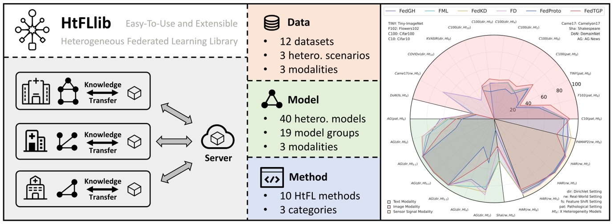

#  HtFLlib: Heterogeneous Federated Learning Library and Benchmark

[](http://arxiv.org/abs/2506.03954)


Accepted by **KDD'25 Benchmark** Track: [paper link](http://arxiv.org/abs/2506.03954).

As AI developing for many years, institutions already have built their specific models with ***heterogeneous model architectures*** for specific local tasks. When faced with **data heterogeneity**, **model heterogeneity**, **communication overhead**, and **intellectual property (IP) protection**, Heterogeneous Federated Learning (HtFL) emerges. 



- **40** heterogeneous model architectures.
- **19** heterogeneous model groups.
- **10** data-free HtFL algorithms.
- [PFLlib](https://github.com/TsingZ0/PFLlib) compatible.
- Pre-trained model support.

🎯**If you find our repository useful, please cite the corresponding paper:**

```
@inproceedings{Zhang2025htfllib,
  author = {Jianqing Zhang, Xinghao Wu, Yanbing Zhou, Xiaoting Sun, Qiqi Cai, Yang Liu, Yang Hua, Zhenzhe Zheng, Jian Cao, Qiang Yang},
  title = {HtFLlib: A Comprehensive Heterogeneous Federated Learning Library and Benchmark},
  year = {2025},
  booktitle = {Proceedings of the 29th ACM SIGKDD Conference on Knowledge Discovery and Data Mining}
}

@article{zhang2025pfllib,
  title={PFLlib: A Beginner-Friendly and Comprehensive Personalized Federated Learning Library and Benchmark},
  author={Zhang, Jianqing and Liu, Yang and Hua, Yang and Wang, Hao and Song, Tao and Xue, Zhengui and Ma, Ruhui and Cao, Jian},
  journal={Journal of Machine Learning Research},
  volume={26},
  number={50},
  pages={1--10},
  year={2025}
}
```

## Environments
Install [CUDA](https://docs.nvidia.com/cuda/cuda-toolkit-release-notes/index.html). 

Install [conda latest](https://repo.anaconda.com/miniconda/Miniconda3-latest-Linux-x86_64.sh) and activate conda. 

```bash
conda env create -f env_cuda_latest.yaml # You may need to downgrade the torch using pip to match the CUDA version
```

## Scenarios and datasets

Here, we only show the MNIST dataset in the ***label skew*** scenario generated via Dirichlet distribution for example. Please refer to my other repository [PFLlib](https://github.com/TsingZ0/PFLlib) for more help. 

*You can also modify codes in PFLlib to support model heterogeneity scenarios, but it requires much effort. In this repository, you only need to configure `system/main.py` to support model heterogeneity scenarios.*

**Note**: you may need to manually clean checkpoint files in the `temp/` folder via `system/clean_temp_files.py` if your program crashes accidentally. You can also set a checkpoint folder by yourself to prevent automatic deletion using the `-sfn` argument in the command line. 

## Data-free algorithms with code (updating)
Here, "data-free" refers to the absence of any additional dataset beyond the clients' private data. We only consider data-free algorithms here, as they have fewer restrictions and assumptions, making them more valuable and easily extendable to other scenarios, such as the existence of public server data. 

- **Local** — Each client trains its model locally without federation.
- **FD (FedDistill)** — [Communication-Efficient On-Device Machine Learning: Federated Distillation and Augmentation under Non-IID Private Data](https://arxiv.org/pdf/1811.11479.pdf) *2018*
- **FML** — [Federated Mutual Learning](https://arxiv.org/abs/2006.16765) *2020*
- **LG-FedAvg** — [Think Locally, Act Globally: Federated Learning with Local and Global Representations](https://arxiv.org/abs/2001.01523) *2020*
- **FedGen** — [Data-Free Knowledge Distillation for Heterogeneous Federated Learning](http://proceedings.mlr.press/v139/zhu21b.html) *ICML 2021*
- **FedProto** — [FedProto: Federated Prototype Learning across Heterogeneous Clients](https://ojs.aaai.org/index.php/AAAI/article/view/20819) *AAAI 2022* 
- **FedKD** — [Communication-efficient federated learning via knowledge distillation](https://www.nature.com/articles/s41467-022-29763-x) *Nature Communications 2022*
- **FedGH** — [FedGH: Heterogeneous Federated Learning with Generalized Global Header](https://dl.acm.org/doi/10.1145/3581783.3611781) *ACM MM 2023*
- **FedTGP** — [FedTGP: Trainable Global Prototypes with Adaptive-Margin-Enhanced Contrastive Learning for Data and Model Heterogeneity in Federated Learning](https://arxiv.org/abs/2401.03230) *AAAI 2024*
- **FedKTL** — [An Upload-Efficient Scheme for Transferring Knowledge From a Server-Side Pre-trained Generator to Clients in Heterogeneous Federated Learning](https://arxiv.org/abs/2403.15760) *CVPR 2024* *(Note: FedKTL requires pre-trained generators to run, please refer to its [project page](https://github.com/TsingZ0/FedKTL) for download links.)*
- **FedMRL** — [Federated Model Heterogeneous Matryoshka Representation Learning](https://arxiv.org/abs/2406.00488) *NeurIPS 2024*

## Experimental results

You can run `total.sh` with *pre-tuned hyperparameters* to obtain some results, like
  ```bash
  cd ./system
  sh total.sh
  ```

Or you can find some results in our accepted FL paper (i.e., [FedTGP](https://github.com/TsingZ0/FedTGP) and [FedKTL](https://github.com/TsingZ0/FedKTL)). *Please note that this developing project may not be able to reproduce the results on these papers, since some basic settings may change due to the requests of the community.* 
